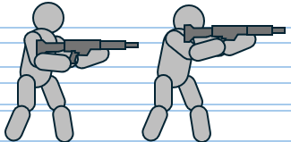
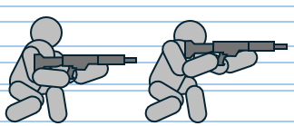
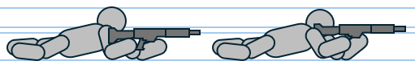
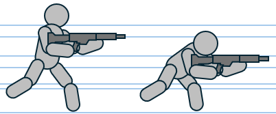
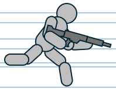
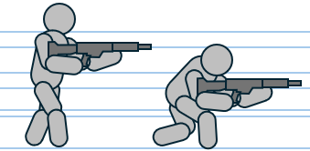

> [목차](../index.html) | [English](stance-movement-en.html)

# 캐릭터 - 자세 및 기동

---

## 자세

### 서기 (Stand)

| 항목 | 내용 |
|------|------|
| 자세 설명 | 기본 상태의 자세 |
| 자세 전환 조작 | 앉기/엎드리기 상태에서 자세 전환 토글 (On/Off) |
| 사격 모드 | 조준 및 비조준 |
| 이동 모드 | 걷기, 달리기 |
| 총구 높이 | 조준: ____cm / 비조준: ____cm (1인칭 시점 기준) |
| 강제 상태 해제 | 리액션(넉백, 넉다운 등), 추락, 사망 |
| 방향 전환 속도 보정 | 없음 |

### 앉기 (Crouch)

| 항목 | 내용 |
|------|------|
| 자세 설명 | 쪼그려 앉은 자세 |
| 자세 전환 조작 | 엎드리기/서기에서 앉기로 토글 |
| 사격 모드 | 조준 및 비조준 |
| 이동 모드 | 걷기, 달리기 |
| 총구 높이 | 조준: ____cm / 비조준: ____cm |
| 강제 상태 해제 | 전력질주(서기 전환 후 시작), 리액션, 추락, 사망 |
| 방향 전환 속도 보정 | 없음 |

### 엎드리기 (Prone)

| 항목 | 내용 |
|------|------|
| 자세 설명 | 땅바닥에 배를 대고 엎드린 엎드려쏴 자세 |
| 자세 전환 조작 | 서기/앉기에서 엎드리기 토글 |
| 사격 모드 | 조준 및 비조준 |
| 이동 모드 | 포복 (이동시 강제 적용) |
| 총구 높이 | 조준: ____cm / 비조준: ____cm |
| 강제 상태 해제 | 전력질주(앉기→서기 후 시작), 추락, 사망(엎드린 상태) |
| 방향 전환 속도 보정 | 50% (마우스: 감도 감소 / 패드: 스틱 각속도 감소) |

---

## 기동

### 달리기 (Run)

| 항목 | 내용 |
|------|------|
| 설명 | 스태미너 소모 없이 조준/비조준하며 이동하는 기본 이동 모드 |
| 이동 모드 전환 | 없음 |
| 사격 모드 | 조준 및 비조준 |
| 허용 자세 | 서기, 앉기 |
| 총구 높이 | 서기 비조준: ____cm / 서기 조준: ____cm / 앉기 비조준: ____cm / 앉기 조준: ____cm |
| 표준 이동 속도 | 서기: ___m/sec / 앉기: ___m/sec |
| 소음 발생 레벨 | 5 (중립) |

### 전력질주 (Sprint)

| 항목 | 내용 |
|------|------|
| 설명 | 사격 자세를 유지하지 않고 전력을 다해 달리는 이동방법. 스태미너 소모 |
| 이동 모드 전환 | 스프린트 버튼 홀드 |
| 사격 모드 | 불가 (격발시 전력질주 해제) |
| 허용 자세 | 서기 중 (엎드리기/앉기 중 시 서기로 강제 전환) |
| 표준 이동 속도 | 서기: ___m/sec |
| 소음 발생 레벨 | 8 (큼) |

### 걷기 (Walk)

| 항목 | 내용 |
|------|------|
| 설명 | 표준 이동보다 느리게 이동하여 소음 발생과 총구 흔들림 최소화 |
| 이동 모드 전환 | 걷기 버튼 홀드 |
| 사격 모드 | 조준 및 비조준 |
| 허용 자세 | 서기, 앉기 |
| 총구 높이 | 서기 비조준: ____cm / 서기 조준: ____cm / 앉기 비조준: ____cm / 앉기 조준: ____cm |
| 표준 이동 속도 | 서기: ___m/sec / 앉기: ___m/sec |
| 소음 발생 레벨 | 2 (작음) |

### 포복 (Crawl)

| 항목 | 내용 |
|------|------|
| 설명 | 엎드린 자세의 기본 이동 모드. 소음 발생 및 총구 흔들림 최소화 |
| 이동 모드 전환 | 없음 (엎드리기 시 자동) |
| 사격 모드 | 불가 (격발시 해제) |
| 허용 자세 | 엎드리기 |
| 총구 높이 | 엎드리기 조준: ____cm / 비조준: ____cm |
| 표준 이동 속도 | 엎드리기: ___m/sec |
| 소음 발생 레벨 | 2 (작음) |
